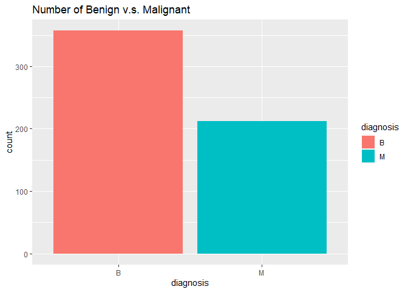
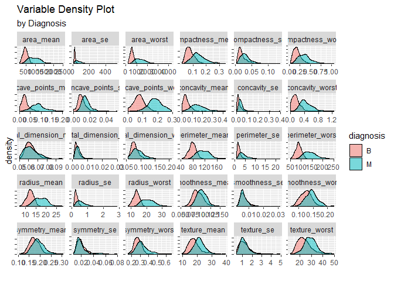

Breast Cancer Study
================

Libraries

``` r
library(tidyverse)
library(ggplot2)
library(randomForest)
library(ROCR)
library(e1071)
```

Load data

``` r
setwd("D:\\University\\Study Materials\\Spring Semester\\Data Mining 1\\Final Project")
breastcancer = read_csv('breast-cancer-wisconsin-data.csv')[,1:32]
```

Data Preparation

``` r
breastcancer = breastcancer %>%
  mutate(diagnosis = as.factor(diagnosis))

colnames(breastcancer)
```

    ##  [1] "id"                      "diagnosis"              
    ##  [3] "radius_mean"             "texture_mean"           
    ##  [5] "perimeter_mean"          "area_mean"              
    ##  [7] "smoothness_mean"         "compactness_mean"       
    ##  [9] "concavity_mean"          "concave points_mean"    
    ## [11] "symmetry_mean"           "fractal_dimension_mean" 
    ## [13] "radius_se"               "texture_se"             
    ## [15] "perimeter_se"            "area_se"                
    ## [17] "smoothness_se"           "compactness_se"         
    ## [19] "concavity_se"            "concave points_se"      
    ## [21] "symmetry_se"             "fractal_dimension_se"   
    ## [23] "radius_worst"            "texture_worst"          
    ## [25] "perimeter_worst"         "area_worst"             
    ## [27] "smoothness_worst"        "compactness_worst"      
    ## [29] "concavity_worst"         "concave points_worst"   
    ## [31] "symmetry_worst"          "fractal_dimension_worst"

``` r
colnames(breastcancer)[10] = "concave_points_mean" 
colnames(breastcancer)[20] = "concave_points_se" 
colnames(breastcancer)[30] = "concave_points_worst" 

str(breastcancer)
```

    ## Classes 'tbl_df', 'tbl' and 'data.frame':    569 obs. of  32 variables:
    ##  $ id                     : num  842302 842517 84300903 84348301 84358402 ...
    ##  $ diagnosis              : Factor w/ 2 levels "B","M": 2 2 2 2 2 2 2 2 2 2 ...
    ##  $ radius_mean            : num  18 20.6 19.7 11.4 20.3 ...
    ##  $ texture_mean           : num  10.4 17.8 21.2 20.4 14.3 ...
    ##  $ perimeter_mean         : num  122.8 132.9 130 77.6 135.1 ...
    ##  $ area_mean              : num  1001 1326 1203 386 1297 ...
    ##  $ smoothness_mean        : num  0.1184 0.0847 0.1096 0.1425 0.1003 ...
    ##  $ compactness_mean       : num  0.2776 0.0786 0.1599 0.2839 0.1328 ...
    ##  $ concavity_mean         : num  0.3001 0.0869 0.1974 0.2414 0.198 ...
    ##  $ concave_points_mean    : num  0.1471 0.0702 0.1279 0.1052 0.1043 ...
    ##  $ symmetry_mean          : num  0.242 0.181 0.207 0.26 0.181 ...
    ##  $ fractal_dimension_mean : num  0.0787 0.0567 0.06 0.0974 0.0588 ...
    ##  $ radius_se              : num  1.095 0.543 0.746 0.496 0.757 ...
    ##  $ texture_se             : num  0.905 0.734 0.787 1.156 0.781 ...
    ##  $ perimeter_se           : num  8.59 3.4 4.58 3.44 5.44 ...
    ##  $ area_se                : num  153.4 74.1 94 27.2 94.4 ...
    ##  $ smoothness_se          : num  0.0064 0.00522 0.00615 0.00911 0.01149 ...
    ##  $ compactness_se         : num  0.049 0.0131 0.0401 0.0746 0.0246 ...
    ##  $ concavity_se           : num  0.0537 0.0186 0.0383 0.0566 0.0569 ...
    ##  $ concave_points_se      : num  0.0159 0.0134 0.0206 0.0187 0.0188 ...
    ##  $ symmetry_se            : num  0.03 0.0139 0.0225 0.0596 0.0176 ...
    ##  $ fractal_dimension_se   : num  0.00619 0.00353 0.00457 0.00921 0.00511 ...
    ##  $ radius_worst           : num  25.4 25 23.6 14.9 22.5 ...
    ##  $ texture_worst          : num  17.3 23.4 25.5 26.5 16.7 ...
    ##  $ perimeter_worst        : num  184.6 158.8 152.5 98.9 152.2 ...
    ##  $ area_worst             : num  2019 1956 1709 568 1575 ...
    ##  $ smoothness_worst       : num  0.162 0.124 0.144 0.21 0.137 ...
    ##  $ compactness_worst      : num  0.666 0.187 0.424 0.866 0.205 ...
    ##  $ concavity_worst        : num  0.712 0.242 0.45 0.687 0.4 ...
    ##  $ concave_points_worst   : num  0.265 0.186 0.243 0.258 0.163 ...
    ##  $ symmetry_worst         : num  0.46 0.275 0.361 0.664 0.236 ...
    ##  $ fractal_dimension_worst: num  0.1189 0.089 0.0876 0.173 0.0768 ...

``` r
table(breastcancer$diagnosis)
```

    ## 
    ##   B   M 
    ## 357 212

``` r
sum(is.na(breastcancer))   # no missing value
```

    ## [1] 0

``` r
dim(breastcancer)
```

    ## [1] 569  32

EDA

``` r
ggplot(breastcancer, aes(x = diagnosis, fill = diagnosis)) +
  geom_bar() +
  labs(title = 'Number of Benign v.s. Malignant')
```

<!-- -->

``` r
feature_names = names(breastcancer)[3:32]

breastcancer %>%
  select(c('diagnosis', feature_names)) %>%
  pivot_longer(cols = feature_names) %>%
  ggplot(aes(x = value)) +
  geom_density(aes(fill = diagnosis), alpha = 0.5) +
  facet_wrap(~name, scales = 'free') +
  labs(title = 'Variable Density Plot',
       subtitle = 'by Diagnosis',
       x = '', y = 'density') +
  theme(axis.text.y = element_blank())
```

<!-- -->

\#outlier analysis \#correlation analysis

Supervised Learning

train-test split

``` r
set.seed(7047)
idx = sample(1:nrow(breastcancer), nrow(breastcancer)*0.75)

bcancer = breastcancer[,-1]

bcancer_train = bcancer[idx,]
bcancer_test = bcancer[-idx,]
```

random-forest

m = sqrt(p) = 6

``` r
cancer_rf = randomForest(diagnosis~., data = bcancer_train, mtry = 6)
cancer_rf
```

    ## 
    ## Call:
    ##  randomForest(formula = diagnosis ~ ., data = bcancer_train, mtry = 6) 
    ##                Type of random forest: classification
    ##                      Number of trees: 500
    ## No. of variables tried at each split: 6
    ## 
    ##         OOB estimate of  error rate: 4.69%
    ## Confusion matrix:
    ##     B   M class.error
    ## B 266   9  0.03272727
    ## M  11 140  0.07284768

``` r
# define cost function

cost_auc = function(prob, obs) {
  pred = prediction(prob, obs)
  perf = performance(pred, "tpr", "fpr")
  cost = slot(performance(pred, "auc"), "y.values")[[1]]
  
  return(cost)
}

#in-sample AUC
cancer_rf_prob_train = predict(cancer_rf, type = "prob")[,2]
cost_auc(cancer_rf_prob_train, bcancer_train$diagnosis)
```

    ## [1] 0.989693

``` r
#out-of-sample AUC
cancer_rf_prob_test = predict(cancer_rf, newdata = bcancer_test,type = "prob")[,2]
cost_auc(cancer_rf_prob_test, bcancer_test$diagnosis)
```

    ## [1] 0.9880048

SVM

``` r
cancer_svm = svm(diagnosis ~ ., data = bcancer_train)

# in-sample
pred_svm_train =  predict(cancer_svm)
table(pred_svm_train, bcancer_train$diagnosis)
```

    ##               
    ## pred_svm_train   B   M
    ##              B 275   6
    ##              M   0 145

``` r
mean(pred_svm_train != bcancer_train$diagnosis)
```

    ## [1] 0.01408451

``` r
# out-of-sample 
pred_svm_test  =  predict(cancer_svm, bcancer_test)
table(pred_svm_test, bcancer_test$diagnosis)
```

    ##              
    ## pred_svm_test  B  M
    ##             B 82  1
    ##             M  0 60

``` r
mean(pred_svm_test != bcancer_test$diagnosis)
```

    ## [1] 0.006993007
