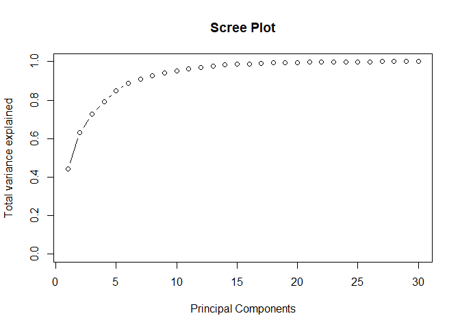
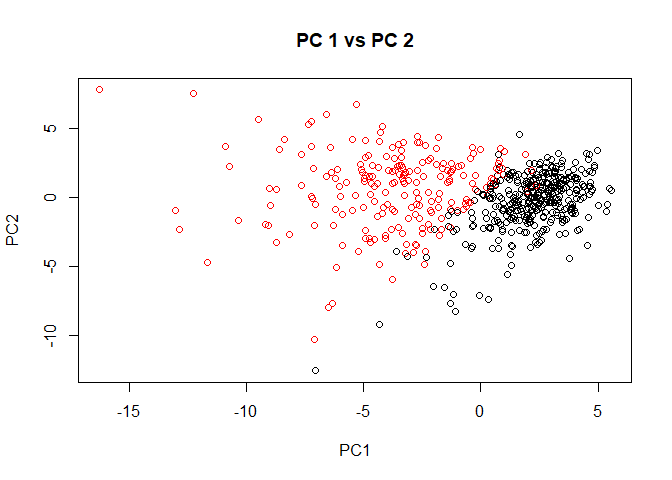
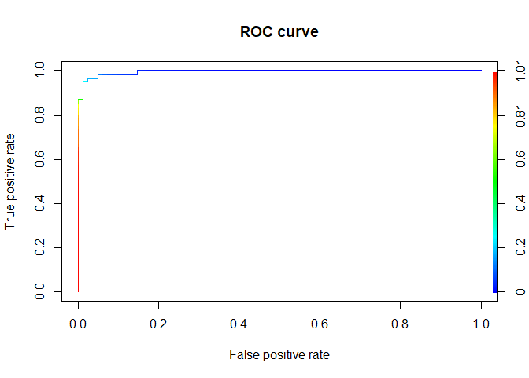

R Notebook
================

``` r
setwd("D:\\University\\Study Materials\\Spring Semester\\Data Mining 1\\Final Project")
breastcancer = read.csv('breast-cancer-wisconsin-data.csv')[,1:32]
```

``` r
head(breastcancer)
```

    ##         id diagnosis radius_mean texture_mean perimeter_mean area_mean
    ## 1   842302         M       17.99        10.38         122.80    1001.0
    ## 2   842517         M       20.57        17.77         132.90    1326.0
    ## 3 84300903         M       19.69        21.25         130.00    1203.0
    ## 4 84348301         M       11.42        20.38          77.58     386.1
    ## 5 84358402         M       20.29        14.34         135.10    1297.0
    ## 6   843786         M       12.45        15.70          82.57     477.1
    ##   smoothness_mean compactness_mean concavity_mean concave.points_mean
    ## 1         0.11840          0.27760         0.3001             0.14710
    ## 2         0.08474          0.07864         0.0869             0.07017
    ## 3         0.10960          0.15990         0.1974             0.12790
    ## 4         0.14250          0.28390         0.2414             0.10520
    ## 5         0.10030          0.13280         0.1980             0.10430
    ## 6         0.12780          0.17000         0.1578             0.08089
    ##   symmetry_mean fractal_dimension_mean radius_se texture_se perimeter_se
    ## 1        0.2419                0.07871    1.0950     0.9053        8.589
    ## 2        0.1812                0.05667    0.5435     0.7339        3.398
    ## 3        0.2069                0.05999    0.7456     0.7869        4.585
    ## 4        0.2597                0.09744    0.4956     1.1560        3.445
    ## 5        0.1809                0.05883    0.7572     0.7813        5.438
    ## 6        0.2087                0.07613    0.3345     0.8902        2.217
    ##   area_se smoothness_se compactness_se concavity_se concave.points_se
    ## 1  153.40      0.006399        0.04904      0.05373           0.01587
    ## 2   74.08      0.005225        0.01308      0.01860           0.01340
    ## 3   94.03      0.006150        0.04006      0.03832           0.02058
    ## 4   27.23      0.009110        0.07458      0.05661           0.01867
    ## 5   94.44      0.011490        0.02461      0.05688           0.01885
    ## 6   27.19      0.007510        0.03345      0.03672           0.01137
    ##   symmetry_se fractal_dimension_se radius_worst texture_worst perimeter_worst
    ## 1     0.03003             0.006193        25.38         17.33          184.60
    ## 2     0.01389             0.003532        24.99         23.41          158.80
    ## 3     0.02250             0.004571        23.57         25.53          152.50
    ## 4     0.05963             0.009208        14.91         26.50           98.87
    ## 5     0.01756             0.005115        22.54         16.67          152.20
    ## 6     0.02165             0.005082        15.47         23.75          103.40
    ##   area_worst smoothness_worst compactness_worst concavity_worst
    ## 1     2019.0           0.1622            0.6656          0.7119
    ## 2     1956.0           0.1238            0.1866          0.2416
    ## 3     1709.0           0.1444            0.4245          0.4504
    ## 4      567.7           0.2098            0.8663          0.6869
    ## 5     1575.0           0.1374            0.2050          0.4000
    ## 6      741.6           0.1791            0.5249          0.5355
    ##   concave.points_worst symmetry_worst fractal_dimension_worst
    ## 1               0.2654         0.4601                 0.11890
    ## 2               0.1860         0.2750                 0.08902
    ## 3               0.2430         0.3613                 0.08758
    ## 4               0.2575         0.6638                 0.17300
    ## 5               0.1625         0.2364                 0.07678
    ## 6               0.1741         0.3985                 0.12440

``` r
pca_data = breastcancer[,-c(1,2)]
head(pca_data)
```

    ##   radius_mean texture_mean perimeter_mean area_mean smoothness_mean
    ## 1       17.99        10.38         122.80    1001.0         0.11840
    ## 2       20.57        17.77         132.90    1326.0         0.08474
    ## 3       19.69        21.25         130.00    1203.0         0.10960
    ## 4       11.42        20.38          77.58     386.1         0.14250
    ## 5       20.29        14.34         135.10    1297.0         0.10030
    ## 6       12.45        15.70          82.57     477.1         0.12780
    ##   compactness_mean concavity_mean concave.points_mean symmetry_mean
    ## 1          0.27760         0.3001             0.14710        0.2419
    ## 2          0.07864         0.0869             0.07017        0.1812
    ## 3          0.15990         0.1974             0.12790        0.2069
    ## 4          0.28390         0.2414             0.10520        0.2597
    ## 5          0.13280         0.1980             0.10430        0.1809
    ## 6          0.17000         0.1578             0.08089        0.2087
    ##   fractal_dimension_mean radius_se texture_se perimeter_se area_se
    ## 1                0.07871    1.0950     0.9053        8.589  153.40
    ## 2                0.05667    0.5435     0.7339        3.398   74.08
    ## 3                0.05999    0.7456     0.7869        4.585   94.03
    ## 4                0.09744    0.4956     1.1560        3.445   27.23
    ## 5                0.05883    0.7572     0.7813        5.438   94.44
    ## 6                0.07613    0.3345     0.8902        2.217   27.19
    ##   smoothness_se compactness_se concavity_se concave.points_se symmetry_se
    ## 1      0.006399        0.04904      0.05373           0.01587     0.03003
    ## 2      0.005225        0.01308      0.01860           0.01340     0.01389
    ## 3      0.006150        0.04006      0.03832           0.02058     0.02250
    ## 4      0.009110        0.07458      0.05661           0.01867     0.05963
    ## 5      0.011490        0.02461      0.05688           0.01885     0.01756
    ## 6      0.007510        0.03345      0.03672           0.01137     0.02165
    ##   fractal_dimension_se radius_worst texture_worst perimeter_worst area_worst
    ## 1             0.006193        25.38         17.33          184.60     2019.0
    ## 2             0.003532        24.99         23.41          158.80     1956.0
    ## 3             0.004571        23.57         25.53          152.50     1709.0
    ## 4             0.009208        14.91         26.50           98.87      567.7
    ## 5             0.005115        22.54         16.67          152.20     1575.0
    ## 6             0.005082        15.47         23.75          103.40      741.6
    ##   smoothness_worst compactness_worst concavity_worst concave.points_worst
    ## 1           0.1622            0.6656          0.7119               0.2654
    ## 2           0.1238            0.1866          0.2416               0.1860
    ## 3           0.1444            0.4245          0.4504               0.2430
    ## 4           0.2098            0.8663          0.6869               0.2575
    ## 5           0.1374            0.2050          0.4000               0.1625
    ## 6           0.1791            0.5249          0.5355               0.1741
    ##   symmetry_worst fractal_dimension_worst
    ## 1         0.4601                 0.11890
    ## 2         0.2750                 0.08902
    ## 3         0.3613                 0.08758
    ## 4         0.6638                 0.17300
    ## 5         0.2364                 0.07678
    ## 6         0.3985                 0.12440

``` r
rownames(pca_data) = breastcancer$id
```

``` r
pca = prcomp(pca_data,scale= TRUE, center = TRUE) # fitting PCA
```

Eigen Values

``` r
pca.var = pca$sdev^2
pca.var.per = round(pca.var/sum(pca.var)*100,1)
as.data.frame(round(pca.var,2))
```

    ##    round(pca.var, 2)
    ## 1              13.28
    ## 2               5.69
    ## 3               2.82
    ## 4               1.98
    ## 5               1.65
    ## 6               1.21
    ## 7               0.68
    ## 8               0.48
    ## 9               0.42
    ## 10              0.35
    ## 11              0.29
    ## 12              0.26
    ## 13              0.24
    ## 14              0.16
    ## 15              0.09
    ## 16              0.08
    ## 17              0.06
    ## 18              0.05
    ## 19              0.05
    ## 20              0.03
    ## 21              0.03
    ## 22              0.03
    ## 23              0.02
    ## 24              0.02
    ## 25              0.02
    ## 26              0.01
    ## 27              0.01
    ## 28              0.00
    ## 29              0.00
    ## 30              0.00

The Eigen values associated with the first 6 PCs are greater than 1.

Scree plot

``` r
pve = pca.var/sum(pca.var)

plot(cumsum(pve), xlab = "Principal Components",
     ylab = "Total variance explained",
     main = "Scree Plot",
     ylim = c(0,1), type = "b")
```

<!-- --> The first 6 PCs
are explaining approximately 90% of the variations.

Scatter plot of observation by PC1 and PC2

``` r
plot(pca$x[,c(1,2)], col = breastcancer$diagnosis, main = "PC 1 vs PC 2")
```

<!-- --> We can see a clear
separation of diagnosis (M or B) from the above PC1 vs PC2 plot.

``` r
head(pca$x,3)
```

    ##                PC1       PC2        PC3       PC4        PC5        PC6
    ## 842302   -9.184755 -1.946870 -1.1221788 3.6305364  1.1940595 1.41018364
    ## 842517   -2.385703  3.764859 -0.5288274 1.1172808 -0.6212284 0.02863116
    ## 84300903 -5.728855  1.074229 -0.5512625 0.9112808  0.1769302 0.54097615
    ##                  PC7         PC8         PC9       PC10       PC11       PC12
    ## 842302    2.15747152  0.39805698 -0.15698023 -0.8766305 -0.2627243 -0.8582593
    ## 842517    0.01334635 -0.24077660 -0.71127897  1.1060218 -0.8124048  0.1577838
    ## 84300903 -0.66757908 -0.09728813  0.02404449  0.4538760  0.6050715  0.1242777
    ##                PC13       PC14         PC15       PC16        PC17        PC18
    ## 842302    0.1032968 -0.6901968  0.601264078  0.7444607 -0.26523740 -0.54907956
    ## 842517   -0.9426998 -0.6529008 -0.008966977 -0.6482383 -0.01719707  0.31801756
    ## 84300903 -0.4102656  0.0166651 -0.482994760  0.3248247  0.19075064 -0.08789759
    ##                PC19       PC20        PC21        PC22        PC23        PC24
    ## 842302    0.1336499  0.3452611  0.09643004 -0.06878939  0.08444429  0.17510221
    ## 842517   -0.2473470 -0.1140327 -0.07725949  0.09449530 -0.21752666 -0.01128019
    ## 84300903 -0.3922812 -0.2043524  0.31079325  0.06025601 -0.07422581 -0.10267142
    ##                PC25         PC26        PC27        PC28         PC29
    ## 842302    0.1508873 -0.201326305 -0.25236294 -0.03388464  0.045607590
    ## 842517    0.1703604 -0.041092627  0.18111081  0.03259550 -0.005682424
    ## 84300903 -0.1710077  0.004731249  0.04952586  0.04698448  0.003143131
    ##                   PC30
    ## 842302    0.0471277407
    ## 842517    0.0018662342
    ## 84300903 -0.0007498749

We can use the first 6 principal components as predictors for fitting
other models.

LDA

``` r
pca.lda = pca$x[,1:6] #selecting the first 6 PCs

diagnosis = as.numeric(breastcancer$diagnosis == "M") #conversion to binary

lda.data = cbind(pca.lda, diagnosis) #binding PCs with the response
head(lda.data)
```

    ##                PC1        PC2        PC3       PC4        PC5         PC6
    ## 842302   -9.184755  -1.946870 -1.1221788 3.6305364  1.1940595  1.41018364
    ## 842517   -2.385703   3.764859 -0.5288274 1.1172808 -0.6212284  0.02863116
    ## 84300903 -5.728855   1.074229 -0.5512625 0.9112808  0.1769302  0.54097615
    ## 84348301 -7.116691 -10.266556 -3.2299475 0.1524129  2.9582754  3.05073750
    ## 84358402 -3.931842   1.946359  1.3885450 2.9380542 -0.5462667 -1.22541641
    ## 843786   -2.378155  -3.946456 -2.9322967 0.9402096  1.0551135 -0.45064213
    ##          diagnosis
    ## 842302           1
    ## 842517           1
    ## 84300903         1
    ## 84348301         1
    ## 84358402         1
    ## 843786           1

``` r
lda.data.df = as.data.frame(lda.data)

#train test split
set.seed(7047)
idx = sample(1:nrow(lda.data.df), nrow(lda.data.df)*0.75)

lda.train = lda.data.df[idx,]
lda.test = lda.data.df[-idx,]

dim(lda.train)
```

    ## [1] 426   7

``` r
dim(lda.test)
```

    ## [1] 143   7

``` r
library(MASS)
```

    ## Warning: package 'MASS' was built under R version 3.6.2

``` r
p_cut = sum(breastcancer$diagnosis == "M")/nrow(breastcancer) #selecting P_cut the naive way

lda <- lda(diagnosis~., 
           data = lda.train) #fitting LDA

prob_train_lda <- predict(lda, data = lda.train) 

table(lda.train$diagnosis, prob_train_lda$posterior[,2] > p_cut, 
      dnn = c("Observed","Predicted"))
```

    ##         Predicted
    ## Observed FALSE TRUE
    ##        0   274    1
    ##        1    14  137

``` r
prob_test_lda <- predict(lda, newdata = lda.test)

table(lda.test$diagnosis, prob_test_lda$posterior[,2] > p_cut, 
      dnn = c("Observed","Predicted"))
```

    ##         Predicted
    ## Observed FALSE TRUE
    ##        0    81    1
    ##        1     5   56

``` r
6/143 #test misclassification rate
```

    ## [1] 0.04195804

ROC Curve

``` r
library(ROCR)
```

    ## Warning: package 'ROCR' was built under R version 3.6.2

    ## Loading required package: gplots

    ## 
    ## Attaching package: 'gplots'

    ## The following object is masked from 'package:stats':
    ## 
    ##     lowess

``` r
pred = prediction(prob_test_lda$posterior[,2], lda.test$diagnosis)
perf = performance(pred, "tpr", "fpr")
plot(perf, colorize=TRUE, main = "ROC curve")
```

<!-- -->

``` r
unlist(slot(performance(pred, "auc"), "y.values"))
```

    ## [1] 0.9954018
